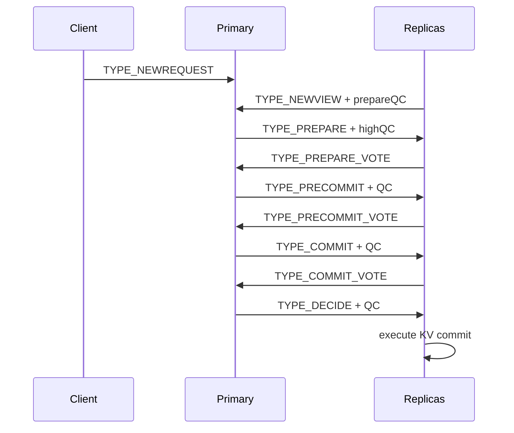

# HS1/PR100 Conformance Report

Version: `v2.14.11-rc.1`

## Executive Summary

The current fork contains a HotStuff-like consensus module under
`platform/consensus/ordering/hotstuff`. It is integrated with a ResilientDB KV
runtime through `benchmark/protocols/hotstuff/kv_service.cpp` and has been
validated by the Chatay warm-cluster and cold-start gates recorded from
`v2.14.6-alpha.1` through `v2.14.10-beta.1`.

The implementation should be described as **HS1/PR100**, not as an exact
drop-in reproduction of the original HotStuff paper. It preserves the main
conceptual elements needed by this thesis track: views, rotating primaries,
NEWVIEW, PREPARE, PRECOMMIT, COMMIT, DECIDE, votes, quorum certificates, highQC,
signature validation and a KV execution path. It also contains ResilientDB- and
Chatay-specific runtime adaptations for local bootstrap and repeatable
experiments.

## Source Map

| Concern | Fork path | Evidence |
|---|---|---|
| Protocol messages | `platform/consensus/ordering/hotstuff/proto/hotstuff.proto` | Defines `HotStuffRequest`, `QC`, `NodeInfo`, phases and signatures. |
| Consensus adapter | `platform/consensus/ordering/hotstuff/consensus.cpp` | Decodes ResilientDB requests and forwards HotStuff messages to commitment logic. |
| Phase machine | `platform/consensus/ordering/hotstuff/commitment.cpp` | Implements NEWVIEW, PREPARE, PRECOMMIT, COMMIT and DECIDE transitions. |
| QC/highQC | `platform/consensus/ordering/hotstuff/commitment.cpp` | Implements `GetQC`, `GetHighQC`, `ProcessNewView` and QC fallback logic. |
| Safety state | `platform/consensus/ordering/hotstuff/message_manager.cpp` | Stores prepare/lock QC and commits decided requests to the executor. |
| KV runtime | `benchmark/protocols/hotstuff/kv_service.cpp` | Wires HotStuff consensus into `KVExecutor` and `ServiceNetwork`. |
| Warm-cluster runner | `tools/chatay/hs1/run_hs1_kv_warm_cluster.sh` | Runs repeatable local KV checks. |
| Cold-start matrix | `tools/chatay/hs1/run_hs1_newview_coldstart_matrix.sh` | Runs repeated cold-start checks with parameterized NEWVIEW bootstrap. |
| Runtime image | `tools/chatay/images/Dockerfile.hs1-runtime` | Builds `chatay-resilientdb-hs1-pr100:v2.14.10-beta.1`. |

## Protocol Elements

| HotStuff concept | HS1/PR100 status | Implementation detail |
|---|---|---|
| View number | Present | `HotStuffRequest.view` and `NodeInfo.Info.view`. |
| Leader/primary per view | Present | `PrimaryId(view)` is used to route NEWVIEW and votes to the expected primary. |
| Proposal node | Present | `NodeInfo` carries data, view/hash metadata, previous pointer and proxy id. |
| Vote | Present | Vote messages are represented by `TYPE_PREPARE_VOTE`, `TYPE_PRECOMMIT_VOTE` and `TYPE_COMMIT_VOTE`. |
| Quorum certificate | Present | `QC` contains a type, node and repeated signatures. |
| highQC | Present | `GetHighQC` selects the highest known prepare-vote candidate for the previous view. |
| lockQC | Present | `MessageManager` tracks lock QC and prepare QC. |
| Safety check | Present, implementation-specific | `IsSaveNode`, highQC hash checks and threshold-signature checks gate replica votes. |
| Execution | Present | DECIDE triggers `MessageManager::Commit`, which forwards the request to the KV executor. |

## Phase Mapping



The phase names match the chained HotStuff vocabulary used in the literature,
but the concrete implementation is the PR100/ResilientDB adaptation. This is
the correct wording for thesis traceability.

## Quorum and Signature Rules

HS1/PR100 gates progress with `config_.GetMinDataReceiveNum()`, which is the
runtime quorum threshold derived from the ResilientDB replica configuration.
The primary broadcasts the next phase only after the required number of
senders has been observed for a phase. Replicas validate either:

- the node signature for non-NEWVIEW messages handled by the primary; or
- the QC signatures for replica-side phase messages.

This is consistent with the BFT requirement that progress depends on a quorum
rather than a single node. For the current thesis wording, the safest claim is
that the implementation follows a BFT quorum model compatible with ResilientDB's
configuration, not that it has a separately proven quorum theorem inside this
fork.

## KV Integration

`benchmark/protocols/hotstuff/kv_service.cpp` constructs:

```txt
GenerateResDBConfig(...)
hotstuff::Consensus(...)
KVExecutor(MemoryDB)
ServiceNetwork(...)
server->Run()
```

This is enough to test HS1 through the same KV-facing shape used by Chatay's
ledger experiments. It does not yet mean HS1 has replaced every production PBFT
entry point of ResilientDB.

## Runtime Evidence

| Version | Evidence |
|---|---|
| `v2.14.6-alpha.1` | HS1 warm-cluster `30/30` runtime gate closed. |
| `v2.14.7-alpha.1` | Cold-start instrumentation added for process, config, consensus, service and NEWVIEW. |
| `v2.14.8-alpha.1` | NEWVIEW bootstrap delay/retry policy parameterized. |
| `v2.14.9-beta.1` | Repeated cold-start matrix closed with mitigated local startup variance. |
| `v2.14.10-beta.1` | Runtime image frozen as `chatay-resilientdb-hs1-pr100:v2.14.10-beta.1`. |

## Deviations from Canonical HotStuff

| Area | Deviation | Thesis wording |
|---|---|---|
| Origin | Based on PR100 ResilientDB contribution path | Use `HS1/PR100` when referring to this implementation. |
| Formal proof | No formal proof is embedded in this fork | The proof basis remains the literature; the fork is an experimental implementation. |
| Bootstrap | Uses Chatay-specific NEWVIEW wait/retry environment variables | Treat as local reproducibility mitigation, not a consensus rule. |
| Runtime | KV service uses an in-memory KV executor for experiments | Suitable for consensus-path experiments, not persistence benchmarking. |
| Production replacement | HS1 is a runnable module and benchmark target | Do not claim it replaces all ResilientDB PBFT deployments. |
| Cold-start | Cold-start can be dominated by local process/config/network startup | Report separately from warm-cluster and steady-state consensus measurements. |

## Accepted Claims

For the thesis report and advisor brief, these claims are acceptable:

1. HS1/PR100 is implemented in C++ inside a ResilientDB fork.
2. HS1/PR100 exposes HotStuff-like phases and QC-based progress.
3. HS1/PR100 is wired to a ResilientDB KV runtime path.
4. HS1/PR100 has repeatable warm-cluster and cold-start validation evidence.
5. HS1/PR100 is suitable as an intermediate baseline before HS2.

## Rejected Claims

These claims should not be made:

1. HS1/PR100 is a formally verified implementation of canonical HotStuff.
2. HS1/PR100 fully replaces all PBFT paths in Apache ResilientDB.
3. HS1/PR100 performance alone proves HS2 superiority.
4. Cold-start timings are consensus latency without segmentation.

## Closing Decision

`v2.14.11-rc.1` closes HS1 as a defensible implementation baseline. The next
version should start HS2 as a clean fork-native port, using the HS1 structure
only as a ResilientDB integration guide.
