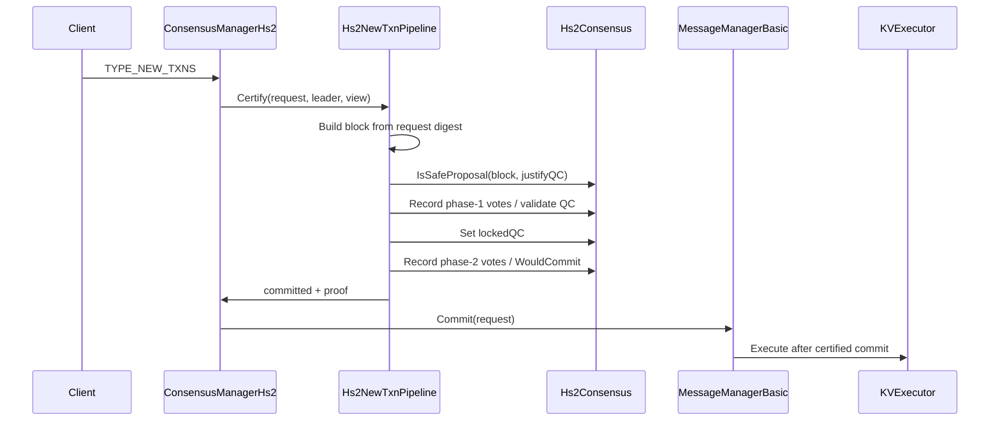

# v2.17.1-alpha.1 - HS2 TYPE_NEW_TXNS Pipeline

Branch: `consensus/hs2-new-txns-pipeline-v2.17.1-alpha.1`

## Purpose

This version hardens the experimental HS2 path so `TYPE_NEW_TXNS` requests do
not go directly from the ResilientDB KV path into `MessageManagerBasic::Commit`.
Before commit, each request now passes through an HS2-oriented certification
gate with block construction, parent linkage, phase-1 QC, phase-2 QC, lock
update and commit proof attachment.

## Claim Boundary

This is still an alpha research implementation. It proves that the KV request
path can be gated by the local HS2 model inside the ResilientDB C++/Bazel
runtime. It does not yet prove a complete production HotStuff-2 deployment with
networked vote exchange, aggregate cryptographic QC material and adversarial
fault scenarios.

Acceptable claim:

```txt
HS2 now gates TYPE_NEW_TXNS in the ResilientDB fork before KV commit, and the
four-replica smoke cluster validates one SET/GET operation through that path.
```

Not acceptable yet:

```txt
HS2 is fully equivalent to the paper algorithm.
HS2 has already been benchmarked fairly against PBFT and HS1.
HS2 is already production-ready Byzantine fault tolerant consensus.
```

## Implementation Summary

| Area | Change |
| --- | --- |
| New pipeline | `platform/consensus/ordering/hs2/hs2_new_txn_pipeline.*` |
| Runtime hook | `ConsensusManagerHs2::HandleNewTransactions` calls `Hs2NewTxnPipeline::Certify` before commit. |
| Local chain state | Pipeline tracks last committed block hash, height and view. |
| Idempotence | Already committed sequence numbers are accepted as duplicate commits so broadcast retries do not stall the KV path. |
| Lock safety | New proposals extend the last committed block, preventing self-rejection after the first committed request. |
| Proof marker | Commit proof is attached to `request.committed_certs` with an `hs2-alpha-commit` marker. |
| Probe | `//benchmark/protocols/hs2:hs2_new_txn_pipeline_probe` covers first commit, duplicate handling and next-block extension. |

## Flow



## Remaining Gaps

- Replace synthetic local quorum voters with actual networked vote exchange.
- Bind QC material to real replica signatures instead of textual alpha proof.
- Route HS2 custom consensus messages beyond `TYPE_NEW_TXNS`.
- Validate stopped node, stopped leader and slow replica scenarios.
- Repeat the smoke in warm-cluster mode before comparative benchmark.
